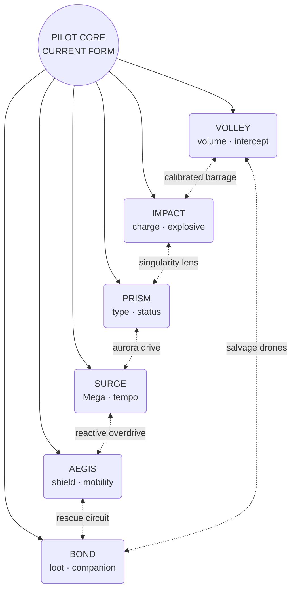

# STARFIGHTER Upgrade Web Redesign

> **Implementation status (2026-07-17, hex-web round).** SHIPPED: everything
> from the previous round (constellation choice surface, complete §9 tell
> layer for the 24 tiers, wing hardpoint dock) PLUS the full hex-web and
> superskills expansion: the **§4 web topology** as data (`WEB_SPOKE_ORDER`
> / `WEB_BRIDGES` / `WEB_SUPERS` / `WEB_SATELLITES` in data.js — 24 anchor
> tiers with unchanged keys, 6 bridges between adjacent wedges, 6
> superskills, 3 satellites = 39 addressable nodes); **§6 bridge
> synergies** (Calibrated Barrage, Singularity Lens, Aurora Drive, Reactive
> Overdrive, Rescue Circuit, Salvage Drones — each a real two-system
> mechanic with classic adapters that keep BREAKER ball-first, persistent
> rig hardware in named slots, and proc tells); **§7 superskills** one per
> constellation (Meteor Matrix, Event Horizon, Elemental Ascension,
> Immortal Reactor, Guardian Angel, Ace Interceptor Wing — gated on Final
> Form + capstone + bridge, larger install beat, rig transformation);
> **§8 in-web mastery** (the three ∞-stacks docked as ranked satellite
> nodes, offered only to fill empty slots, wedge-capped first); the **§10
> offer algorithm** (Commit/Adapt/Explore composition, superskill priority,
> post-evolution guarantee, reroll anti-repeat, 4-draft pity, low-health
> rescue, offense/non-offense guard); **graph-safe knockout** (leaf-only
> regression — never orphans a bridge or recipe); **checkpoint schema v3**
> with a never-throws v1/v2 migration and grandfather rule; and the map at
> 39 nodes (two-tone bridge hexes, double-hex super crowns, ranked
> satellites, exact lock reasons, keyboard/touch, desktop + 390×844 +
> 844×390). Locked by 7 new invariant suites — 39/39 green.
> REMAINING (deliberately deferred): §3 route tracking, the §7 triad chase
> supers (War Machine / Celestial Guardian), §10 discovery codex + stellar
> currents, animated node previews in the detail panel, and the Rift
> rewards' off-map cluster presentation (they remain their own fixed
> draft).

## Executive recommendation

Replace the current card-first, six-row linear skill tree with a **full-screen hex constellation that is both the map and the choice interface**. After every cleared stage, three reachable nodes on the constellation glow as the current offers. The player inspects and installs one directly on the map. The existing icon, upgrade name, description, tier comparison, and synergy copy move into a persistent detail panel; they are no longer separated from the tree.

The web should be centered on the selected pilot and divided into three progression rings:

1. **Form I — Launch Systems:** available from the start.
2. **Form II — Evolved Systems:** unlocked when the pilot actually reaches `starterLvl >= 2`.
3. **Final Form — Apex Systems:** unlocked when the pilot reaches `starterLvl >= 3`.

Six familiar constellations radiate from the pilot core: **Volley, Impact, Prism, Aegis, Surge, and Bond**. Each splits into distinct sub-branches, reconnects to related constellations through mid-run bridge nodes, and culminates in capstones and combination superskills. A 27-stage run still awards one choice per clear, but the player selects from roughly 56 authored nodes rather than completing almost all 24 linear tiers. That creates actual build identity and makes different runs diverge.

The recommended first release keeps the topology fixed and learnable. The randomness comes from which reachable frontier nodes are offered, the pilot and starter ability, and the player's route. Seeded topology variants can be added after the authored web is balanced; fully randomizing the chart at launch would make an already information-dense system harder to read.

---

## 1. Current-system audit

The present system is more capable than its interface suggests:

- Six paths with four sequential tiers each: Volley, Impact, Prism, Aegis, Surge, and Bond.
- One permanent upgrade is drafted after every cleared stage in the 27-stage journey.
- Three cards are offered, with one reroll per screen.
- The offer logic guarantees offense and non-offense representation while both remain, favors continuing an invested path, and boosts survival offers at low health.
- A separate **Full Tree** shows all paths, but it is inspection-only. Actual selection still happens on detached cards.
- After all 24 authored tiers are exhausted, three generic mastery items stack forever.
- Three secret Rift upgrades live outside the normal tree.
- Knockout removes two path levels; true game over occurs only when the tree is empty.
- The pilot visibly evolves, weapon paths already alter some hardware/projectiles, shields render around the ship, and compact held-item badges orbit the STARFIGHTER pilot.
- Checkpoints persist `path`, `upg`, and `stacks` in save schema version 2.

### What should be preserved

- One consequential choice after every stage.
- Three highlighted choices and one reroll; three is fast to compare and already works on touch.
- Offense/non-offense safeguards and low-health rescue weighting.
- The current upgrade icons, concise descriptions, type system, shield, heat, charge, Mega, pickup, and catch mechanics.
- Secret Rift rewards as exceptional nodes.
- Knockout consuming build power instead of immediately ending a long run.
- Mode-aware descriptions so STARFIGHTER never reads ball or paddle instructions.
- Existing mobile performance, safe-area, reduced-flash, and readability constraints.

### What should change

- The tree becomes the primary choice surface, not a reference modal.
- Paths become graphs rather than four-item queues.
- Evolution state, prerequisites, bridge routes, exclusions, and superskill recipes become first-class data.
- Every installed node has an acquisition effect and a persistent in-combat visual tell.
- Generic mastery stacks become attached satellite nodes on the same web.
- The player can see a route, understand why a node is locked, and deliberately build toward it.

---

## 2. Design lessons to borrow—not copy

### Hades II: Path of Stars

The useful idea is the constellation itself: upgrades are spatial, paths are legible, and later improvements feel like travel through a magical chart. Hades II also varies the exact Hex upgrade tree between runs. STARFIGHTER should borrow the visual language and route planning, while initially keeping its core map stable so players can learn recipes and read it quickly on a phone.

### Nova Drift: Super Mods

Super Mods enter the normal upgrade pool only after their special requirements are met. They are frequently rule-changing and may have meaningful costs. This is the strongest model for STARFIGHTER superskills: do not clog early offers with irrelevant powers; surface a super only when the current build activates its recipe.

### 20 Minutes Till Dawn: Synergies

Synergies appear only after prerequisite upgrades are owned and use a distinct visual treatment. STARFIGHTER should similarly give bridge synergies and superskills a unique border, sound, connector animation, and detail-panel recipe.

### Vampire Survivors: Evolutions and Unions

Combining a developed weapon with another component produces a transformed weapon rather than another percentage bump. STARFIGHTER should use this as the standard for outer-ring weapon nodes: the rig, projectile, audio, and combat behavior all transform together.

### Deep Rock Galactic: Survivor: Overclocks

Weapons receive transformative choices at known level thresholds, with the most extreme overclock saved for the final threshold. STARFIGHTER's evolution rings provide clearer fiction for the same pacing: foundations in Form I, build-defining overclocks in Form II, and unstable/apex transformations in Final Form.

### Brotato: tags and build-biased offers

Weapon classes create bonuses from shared tags and also make related shop results more likely. STARFIGHTER should tag every node—such as `projectile`, `charge`, `explosive`, `element`, `shield`, `mega`, `pickup`, and `companion`—and use those tags to make the draft follow the player's emerging build without becoming deterministic.

### Risk of Rain 2: visible inventory

Risk of Rain 2 formalizes rules for attaching item displays to the survivor model. STARFIGHTER needs a lighter 2D equivalent: every node declares which visual slot it affects, and compatible visuals compose rather than producing an unreadable orbit of dozens of icons.

---

## 3. The new between-stage experience

### Default flow

1. The stage-clear and journey beat plays as it does now.
2. The camera settles on the pilot core in the upgrade constellation.
3. Owned routes illuminate outward from the center.
4. Exactly three currently offered nodes pulse with numbered halos.
5. The player can inspect any node. Selecting one uses the same symbol, name, description, tags, comparison, and synergy explanation the cards use now.
6. Selecting an offered node enables **Install**. Selecting another reachable but unoffered node offers **Track Route**. Selecting a locked node explains every unmet requirement.
7. Confirming sends the node glyph along its connector into the pilot. The pilot's persistent visual changes in the same beat.
8. The next stage begins.

The map must not add an extra decision after the current decision. Inspecting and installing should be as fast as selecting and confirming a card today.

### Offer presentation on the web

- **Owned:** solid color, filled center, lit connectors.
- **Offered now:** bright white rim, slow pulse, numbered `1–3`, animated path from the nearest owned node.
- **Reachable but not offered:** colored outline; inspectable and trackable.
- **Evolution-locked:** visible silhouette plus a Form II or Final Form crest.
- **Prerequisite-locked:** dim node with the missing parent connector dashed.
- **Excluded by a choice:** crossed connector and the name of the chosen alternative.
- **Bridge synergy:** two-tone border using both constellation colors.
- **Superskill:** larger six-point node, animated dual-color corona, recipe shown in the detail panel.
- **Repeatable mastery:** small satellite orbit attached to a completed constellation rather than a detached card.

### Detail panel

The selected node's panel should contain:

- Existing glossy symbol.
- Name and one-sentence behavior description.
- Exact mechanical deltas, with before/after values when practical.
- Tags and the part of the pilot it modifies.
- `OWNED`, `OFFERED`, `REACHABLE`, `FORM II`, `FINAL FORM`, or exact lock reason.
- Required parents and any mutually exclusive alternative.
- Synergy recipe and the resulting superskill, if relevant.
- A small animated preview of the projectile, shield, trail, drone, or rig change for weapon-defining nodes.
- Install/confirm action only for one of the three current offers.

### Route tracking

The player may track one reachable or locked node. Tracking does not guarantee it, but increases the offer weight of eligible ancestors and bridge nodes leading toward it. This adds agency without eliminating adaptation. The tracked route gets a thin gold path and remains saved in the checkpoint.

---

## 4. Hex-web topology

### High-level map



The actual canvas layout should use axial hex coordinates, not freeform screen coordinates. Each constellation owns one 60-degree wedge. The pilot core is at `(0,0)`; Form I occupies the inner ring, Form II the middle ring, and Final Form plus superskills the outer ring.

### The three rings

| Ring | Campaign availability | Purpose | Expected owned picks by end |
|---|---|---|---:|
| Form I | Stages 1–9 | Establish two or three build directions; no supernodes | 9 |
| Form II | After actual first evolution | Deepen a route or enter a related route through a bridge | 18 total |
| Final Form | After actual final evolution | Capstones, transformed weapons, superskills, mastery satellites | 27 total |

The gate must query actual evolution state:

- Normal starters unlock Form II at the current transition into region 4 and Final Form at region 7.
- Pikachu unlocks Form II only when it actually becomes Raichu in region 5; its existing strength compensates for the later gate. Its ability-rank III unlocks Final Form nodes normally.
- **No Partner** uses a visible Training Drone Mk II/Mk III chassis upgrade at the same act boundaries so it is not locked out of the system.
- Trial mode derives the appropriate form from its starting stage and grants a legal connected build, rather than sprinkling arbitrary nodes.

### Branch hopping halfway through

Each neighboring pair of constellations has one Form II bridge. A bridge may be reached from either side and then unlocks a specific middle node in the neighboring branch without requiring that branch's Form I root.

Rules that keep hopping fair:

- The bridge itself costs one stage-clear pick.
- Skipped lower nodes are not granted for free.
- A bridge opens a named middle entry, not the whole neighboring constellation.
- Capstones still require a minimum number of matching tags or a named prerequisite.
- The connection is bidirectional when the fiction and mechanics make sense.
- Unrelated branches do not get arbitrary shortcuts; their combination belongs in an explicit super recipe instead.

---

## 5. Proposed STARFIGHTER node catalog

This catalog deliberately mixes existing, proven mechanics with new transformations. Names are working names; effects and values require simulation and playtesting.

### Volley constellation — volume, cooling, interception

| Gate | Node | Effect | Persistent visual |
|---|---|---|---|
| Form I | **Coolant Loop** | Heat per basic shot −20%; heat vents sooner after releasing fire | Cyan coolant ring around the weapon core |
| Form I | **Twin Cannon** | Two bolts at reduced per-bolt damage; preserves current total-DPS discipline | Two clearly separated muzzle points |
| Form I | **Interceptor Lattice** | Basic bolts destroy one additional enemy shot | Cyan targeting prongs and a hex flash on interception |
| Form II | **Cycler Fins** | Fire rate rises and heat per shot falls; sustained fire reaches a stable cadence | Side fins open as cadence increases |
| Form II | **Scatter Array** | Every sixth volley fires a shallow three-lane microburst | Triple muzzle fan and narrower microbolts |
| Final | **Hypercycle Gatling** | Holding fire spins up through three cadence steps; movement or release spins it down | Three-barrel rotating crown; pitch ramps with spin |
| Final | **Guardian Swarm** | Interceptions charge two orbiting drones that fire a counter-volley | Two small cyan drones, visible charge pips |

### Impact constellation — heavy shots, charge, penetration

| Gate | Node | Effect | Persistent visual |
|---|---|---|---|
| Form I | **Heavy Core** | Wider bolts, +15% damage, faster charge build; adapts current Heavy Bolt | Amber bore and chunkier projectile silhouette |
| Form I | **Accelerated Charge** | First 50% of charge builds rapidly; full charge retains heat cost | Expanding amber rings around the pilot while holding |
| Form I | **Kinetic Recoil** | Releasing a high charge nudges the pilot backward and grants a short damage-avoidance window | Recoil kick, exhaust burst, brief white outline |
| Form II | **Splash Charge** | A spent charged shot detonates for typed area damage; adapts current implementation | Element-colored explosion with amber shock ring |
| Form II | **Pulse Round** | A periodic basic volley pierces multiple targets; adapts current implementation | Long, needle-shaped pulse with a count tell on the bore |
| Final | **Rail Lance** | Full charge becomes a narrow, high-damage lane-clearing beam; reduced blast radius | Long nose rail, straight charge guide, deep beam audio |
| Final | **Nova Bomb** | Full charge becomes a slow large projectile that detonates repeatedly; higher heat and slower charge | Oversized chamber, orbiting charge motes, expanding nova shell |

### Prism constellation — type mastery, adaptation, status

| Gate | Node | Effect | Persistent visual |
|---|---|---|---|
| Form I | **Attune** | Element pickups last 50% longer; adapts current implementation | Faceted teal ring in the live element color |
| Form I | **Amplify** | Super-effective hits deal +30% damage; adapts current implementation | Super-effective hit gets a prism starburst |
| Form I | **Refract** | The first resisted hit redirects to a nearby target before resistance is applied | Projectile splits through a visible prism shard |
| Form II | **Transfuse** | Element orbs arrive sooner and bad matchups do not burn the element off; adapts current implementation | Orb compass orbiting the core |
| Form II | **Resonance Mark** | Repeated same-type hits mark a target; changing type detonates stored marks | One to three colored facets attach to marked enemies |
| Final | **Omni Lens** | Attacks ignore resistance; adapts current capstone | Large clear lens over the muzzle; resistance text disappears |
| Final | **Spectrum Engine** | Super-effective kills bank a rotating favored type; manual Mega activation consumes it for a typed opening burst | Six-color core rotation, then locks to the banked type |

### Aegis constellation — shields, counterplay, mobility

| Gate | Node | Effect | Persistent visual |
|---|---|---|---|
| Form I | **Home Guard** | Start waves with one shield; adapts current implementation | Shield bubble and one bright charge pip |
| Form I | **Bulwark Cells** | Shield capacity increases; adapts current implementation | Extra segmented plates around the bubble |
| Form I | **Phase Thrusters** | Faster vertical follow and a brief grace period after a sharp direction change; hurtbox never grows | Paired green wing thrusters and afterimage trail |
| Form II | **Reactive Plating** | Losing a shield destroys nearby normal enemy shots | Shield breaks outward in a green cancellation ring |
| Form II | **Regenerator** | A shield charge regrows after a no-hit interval; adapts current capstone at a tuned rate | Empty pips slowly refill clockwise |
| Final | **Fortress Shell** | At full shields, charged shots cannot be interrupted and incoming heavy splash is reduced | Thick plated bubble and locked charge reticle |
| Final | **Mirror Aegis** | Perfectly timed movement through a near miss reflects one enemy shot on cooldown | Bubble facets flip outward; reflected shot turns green-white |

### Surge constellation — Mega generation, timing, transformation

| Gate | Node | Effect | Persistent visual |
|---|---|---|---|
| Form I | **Momentum** | Basic hits charge Mega; adapts current implementation | Gold current travels from muzzle to Mega core on hit |
| Form I | **Rally Master** | Kills charge Mega faster and improve combo score; adapts current implementation | Kill sparks spiral toward the core |
| Form I | **Reserve Battery** | Meter can store a small overflow that remains after Mega ends | Second thin gold ring outside the main meter |
| Form II | **Quick Ignition** | Activating Mega before a full overflow shortens it but refunds part of the meter on elite kills | Ignition key glyph; refund arcs back to the ring |
| Form II | **Overdrive Core** | Mega lasts longer and explosive attacks grow; adapts current implementation | Larger gold core and powered wing veins |
| Final | **Apex Mega** | Nine-second Mega and a major all-attack bonus; adapts current capstone | Existing rainbow treatment plus an evolved weapon silhouette |
| Final | **Chain Reactor** | Superskill triggers and boss-phase breaks grant a short micro-Mega without consuming the main meter | Core flashes from gold to white; distinct short aura |

### Bond constellation — pickups, healing, catches, companions

| Gate | Node | Effect | Persistent visual |
|---|---|---|---|
| Form I | **Item Magnet** | Pickups drift toward the pilot; adapts current implementation | Pink magnet vanes on the rig; faint pickup tether |
| Form I | **Fortune** | Higher power-up drop chance; adapts current implementation | Gold-pink lucky charm orbiting near the pilot |
| Form I | **Trainer's Bond** | Catches permanently increase run score and add a small catch-combo benefit | Poké Ball crest gains one notch per catch threshold |
| Form II | **Salvage Net** | Shooting a pickup collects it without consuming the shot; excess timed-item pickups convert to meter | Forward pink collection mesh; pickup-to-core trail |
| Form II | **Wingmate Beacon** | Catches charge a temporary companion that attacks during the next elite or boss wave | One small companion silhouette in a reserved orbit slot |
| Final | **Max Revive** | +1 life now and after each region; adapts current capstone | Heart canister on the rear rig and a revive flare |
| Final | **Ace Squadron** | The companion becomes permanent for the run and inherits a portion of projectile tags | Two formation lights; companion attack uses matching color/shape |

---

## 6. Form II bridge synergies

Bridge nodes are both route shortcuts and meaningful two-system interactions.

| Bridge | Connects | Requirement | Effect |
|---|---|---|---|
| **Calibrated Barrage** | Volley ↔ Impact | One Volley and one Impact node, or the bridge's named alternate parent | Releasing a charge empowers the next three basic volleys; rapid hits shorten the next charge |
| **Singularity Lens** | Impact ↔ Prism | Charged or heavy tag plus an element node | Charged detonations pull light enemies inward and copy the live element to the blast |
| **Aurora Drive** | Prism ↔ Surge | Type-mastery tag plus a Mega-generation node | Super-effective hits charge Mega; Mega begins with a short favorable-type burst |
| **Reactive Overdrive** | Surge ↔ Aegis | Shield plus Mega tag | Shield breaks grant meter; entering Mega immediately restores one missing shield on cooldown |
| **Rescue Circuit** | Aegis ↔ Bond | Shield plus pickup/heal tag | Excess healing becomes shield-recharge progress; collecting a potion clears the shield-recharge delay |
| **Salvage Drones** | Bond ↔ Volley | Pickup/catch plus projectile tag | Collecting items or completing catches charges drone volleys that seek enemy shots first |

These nodes use `requiresAny` parents so the player can approach from either side. Owning a bridge exposes the named Form II entry in the neighboring constellation, enabling the requested halfway branch hop without granting the skipped Form I effects.

---

## 7. Final-form superskills

Superskills should be rare, visibly transformative, and recipe-driven. They enter the offer pool only when their prerequisites are owned and the pilot has reached Final Form. They do not need an additional hidden chest or random event; the achievement is completing the route.

| Superskill | Recipe | Rule change | Full visual transformation |
|---|---|---|---|
| **Meteor Matrix** | Calibrated Barrage + a Volley capstone + an Impact capstone | Every full charge releases a delayed rain of smaller versions of the current basic projectile | Heavy center cannon plus deployed side racks; meteor trails match element |
| **Event Horizon** | Singularity Lens + Splash Charge + Resonance Mark | Charged explosions become a short-lived gravity well that pulls marked enemies and detonates marks | Black-prism orb with bright elemental rim; enemies visibly arc inward |
| **Elemental Ascension** | Aurora Drive + Prism capstone + Surge capstone | During Mega, attacks rotate through favorable types and super-effective kills extend the rotation, not total Mega duration | Rainbow lens halo, rotating type glyph, projectile changes every beat |
| **Immortal Reactor** | Reactive Overdrive + Aegis capstone + Surge capstone | Once per wave, lethal damage consumes all Mega charge instead; a full shield-break counterburst follows | Gold-green armored core cracks, then re-forms around the pilot |
| **Guardian Angel** | Rescue Circuit + Aegis capstone + Bond capstone | Healing, catches, and revives charge a guardian pulse that clears enemy shots and heals one life at full charge | Large companion sigil behind the pilot; pink-green pulse wings |
| **Ace Interceptor Wing** | Salvage Drones + Volley capstone + Bond capstone | Permanent wingmates inherit Twin/Scatter/Pulse behavior at reduced damage and prioritize threats | Readable three-ship formation with matching muzzles |
| **War Machine** | Three owned nodes each from Volley, Impact, and Surge plus either Meteor Matrix or a compatible pair | Weapon can switch between rapid and charged forms without resetting cadence; both share heat, forcing deliberate rhythm | Rig mechanically folds between Gatling and rail silhouettes |
| **Celestial Guardian** | Three owned nodes each from Prism, Aegis, and Bond plus either Guardian Angel or a compatible pair | Pickups, shields, and type changes feed one shared constellation meter that emits a typed protection burst | Six-point halo behind the pilot with three colored sectors filling |

The two triad supers are intended as difficult late-run chase builds, not standard outcomes. A healthy run should usually complete one pair super and occasionally a triad super.

---

## 8. Repeatable mastery without leaving the web

After a constellation's authored nodes and eligible capstone are complete, one attached satellite becomes repeatable:

- **Power Satellite:** all attack damage +4% per rank.
- **Coolant Satellite:** heat per shot −4% per rank, with a hard effective cap.
- **Fortune Satellite:** score and drop quality +4% per rank.

Only satellites relevant to the owned tags may be offered. They remain visible on the map, display their rank, and obey diminishing returns. They should never crowd out an available authored node or superskill.

This replaces the current detached forever-stacking items while preserving the guarantee that late runs always receive a useful choice.

---

## 9. Visual-feedback contract

Every node must define three visual outcomes:

1. **Acquisition:** a short one-time install animation.
2. **Persistent tell:** something visible on the pilot, rig, projectile, shield, companion formation, aura, or trail.
3. **Proc tell:** a readable effect when the mechanic activates.

An upgrade is not content-complete until all three are specified and at least the persistent tell and proc tell are implemented.

### Composable rig slots

To prevent visual clutter, nodes write to named slots rather than each adding another orbiting badge:

| Slot | Owns | Examples |
|---|---|---|
| `muzzle` | Number and placement of firing points | Twin Cannon, Hypercycle Gatling |
| `barrel` | Primary weapon silhouette | Heavy Core, Rail Lance, Nova Bomb |
| `sidecar` | Auxiliary hardware | Scatter Array, drone launch rack |
| `core` | Heat, Mega, or element engine | Coolant Loop, Spectrum Engine, Overdrive Core |
| `wings` | Mobility and defense silhouette | Phase Thrusters, Fortress Shell |
| `shield` | Bubble shape, plates, pips | Bulwark Cells, Mirror Aegis |
| `companion` | One reserved readable formation | Wingmate Beacon, Ace Squadron |
| `orbit` | Maximum three compact utility charms | Fortune, secret Rift reward, tracked superskill |
| `projectile` | Shape layers and trail | Pulse, element, heavy, super behavior |
| `aura` | Temporary state | Mega, shield break, synergy activation |

Priority rules compose compatible changes and choose a single dominant silhouette for incompatible ones. For example, Twin Cannon changes muzzle count while Rail Lance changes barrel shape; both can show. Rail Lance and Nova Bomb both occupy the primary barrel form and therefore become mutually exclusive capstones.

### Weapon visual rules

- Weapon-changing nodes must alter both idle silhouette and projectile behavior.
- Projectile size alone is insufficient; use shape, trail, cadence, recoil, and audio.
- Element color remains authoritative, while shape communicates the weapon build.
- Enemy-shot interception needs a distinct cancellation glyph so it cannot be mistaken for damage.
- Companion attacks use reduced brightness and smaller silhouettes so the player remains visually dominant.
- Final-form transforms get a stronger acquisition beat, but gameplay must resume in under roughly one second.

### Accessibility and performance

- Never rely on color alone: every constellation keeps a unique glyph and connector pattern.
- `reduceFlash` replaces blooms and screen pulses with scale, line, and sound cues.
- Repeated projectile and node effects use pre-baked sprite caches; do not allocate gradients or large shadows per entity per frame.
- The pilot and enemy shots retain contrast priority over orbiters, companions, and decorative particles.
- The map supports a high-contrast connector mode and larger detail text.

---

## 10. Offer algorithm and replayability

### Eligibility

A node is eligible only if:

- It is not owned and is not excluded by an owned choice.
- Its actual `minEvolution` gate is satisfied.
- All `requiresAll` nodes are owned.
- At least one `requiresAny` node is owned, when present.
- Its mode includes STARFIGHTER.
- Its superskill recipe is satisfied, if it is a super.
- It has no unmet campaign or secret condition.

### Three-offer composition

When possible, each screen should contain:

1. **Commit:** a node that continues one of the player's two most-invested tag groups.
2. **Adapt:** survival, mobility, type counterplay, or recovery weighted by current health and recent deaths.
3. **Explore:** a bridge, second branch, superskill, or under-invested option.

Exceptions:

- An eligible superskill replaces Explore and receives strong priority, but is not guaranteed if several supers are available.
- At low health, at least one legal Aegis/Bond recovery node is forced when available.
- Immediately after evolution, at least one newly unlocked ring node is shown.
- A tracked route raises the score of its legal next steps.
- No mastery satellite appears while three authored nodes are eligible.

### Anti-frustration rules

- Do not offer the same rejected node on the immediate reroll.
- A reachable node not seen for four drafts gains pity weight.
- At least two distinct constellations should be represented unless the legal frontier makes that impossible.
- Do not offer three nodes that all increase only damage numbers.
- Secret Rift nodes remain their own fixed three-choice event, but appear as a temporary off-map rift cluster connected to the pilot core.
- Daily mode uses a deterministic seed for offers and tie-breaking.

### Replayability layers

1. **Starter ability and type:** already 18 strongly different foundations.
2. **Early fork:** each constellation supports two identities.
3. **Bridge choice:** six ways to hop between related systems.
4. **Capstone exclusion:** paired outer weapon forms cannot both be installed.
5. **Superskill recipe:** the endpoint depends on combinations, not a single completed row.
6. **Offer adaptation:** the run responds to investment and danger without becoming scripted.
7. **Discovery record:** a constellation codex records seen, installed, and completed supers; it unlocks knowledge and cosmetics, not raw permanent power.

After the stable web is balanced, a later update can add **stellar currents**: a seeded set of optional satellite nodes or boosted bridge lanes. Core locations, prerequisites, and all evolution gates should remain fixed.

---

## 11. Balance framework

### Prefer transformations over arithmetic

At least two-thirds of authored nodes should change behavior, trigger conditions, targeting, resource flow, or visuals. Pure percentage nodes are acceptable as foundations and repeatable satellites, not as most of the web.

### Use explicit power budgets

Evaluate each node in four independent budgets:

- **Single-target damage** against bosses.
- **Crowd control/coverage** against flocks.
- **Survival/resource economy** against enemy fire and attrition.
- **Score/drop economy**, which must not secretly become the best damage path through excessive pickups.

A node may be strong in two budgets if it pays through heat, charge time, positioning, shield consumption, opportunity cost, or a mutually exclusive capstone.

### Control multiplicative explosions

- Additive bonuses should combine before multiplicative superskill modifiers.
- Twin/multi-projectile damage must preserve a declared total-DPS baseline before other synergies.
- Proc chains need a generation marker so a proc cannot recursively trigger itself.
- Companions inherit a limited allowlist of tags and reduced coefficients.
- Area damage has per-target and boss coefficients.
- Mega extension has a hard duration cap; supers can change output, not create infinite duration.
- Coolant mastery has an effective floor so heat never becomes irrelevant.
- Shield recharge pauses after damage and cannot create permanent invulnerability.

### Intended build examples

- **Gatling Interceptor:** Twin Cannon → Interceptor Lattice → Guardian Swarm → Salvage Drones.
- **Nova Bomber:** Heavy Core → Splash Charge → Nova Bomb → Singularity Lens → Event Horizon.
- **Rail Ace:** Accelerated Charge → Pulse Round → Rail Lance → Calibrated Barrage.
- **Elemental Overdrive:** Amplify → Resonance Mark → Spectrum Engine → Aurora Drive → Elemental Ascension.
- **Phase Fortress:** Phase Thrusters → Reactive Plating → Mirror Aegis → Reactive Overdrive.
- **Collector Squadron:** Fortune → Wingmate Beacon → Ace Squadron → Salvage Drones → Ace Interceptor Wing.
- **Mega Tank:** Bulwark Cells → Regenerator → Fortress Shell → Overdrive Core → Immortal Reactor.
- **Guardian Support:** Transfuse → Rescue Circuit → Max Revive → Guardian Angel.

No one example should be the mathematically correct answer for every starter or boss.

---

## 12. Data and code architecture

### Declarative node schema

The new content should live in data, not switch statements scattered through rendering and combat code.

```js
{
  id: 'volley.twin_cannon',
  constellation: 'volley',
  ring: 1,
  minEvolution: 1,
  hex: { q: 2, r: -1 },
  icon: 'laser',
  name: 'TWIN CANNON',
  desc: 'Fire two bolts; each deals reduced damage.',
  tags: ['weapon', 'projectile', 'multi'],
  requiresAll: ['core.launch'],
  requiresAny: [],
  excludes: [],
  maxRank: 1,
  legacyKey: 'twin',
  visual: { slot: 'muzzle', variant: 'twin' },
  tuning: { projectileCount: 2, projectileDamageMul: 0.6 },
}
```

Supers add a recipe and bridge nodes add alternate parents:

```js
{
  id: 'super.meteor_matrix',
  kind: 'super',
  ring: 3,
  minEvolution: 3,
  requiresAll: ['bridge.calibrated_barrage'],
  recipe: {
    any: [
      ['volley.hypercycle_gatling', 'impact.rail_lance'],
      ['volley.guardian_swarm', 'impact.nova_bomb'],
    ],
  },
  tags: ['weapon', 'projectile', 'charge', 'super'],
}
```

### Recommended module boundaries

- `js/upgrade-data.js`: constellation definitions, nodes, edges, copy, visuals, recipes, legacy mappings.
- `js/upgrade-system.js`: eligibility, frontier, offer scoring, install/remove, dependency-safe regression, migration, graph validation.
- `js/render.js`: hex-map rendering, detail panel, node preview, rig slots, proc visuals.
- `js/input.js`: map pan/selection, keyboard/controller navigation, confirm, reroll, track route.
- `js/update.js`: generic tag/proc dispatch plus mechanics that genuinely require dedicated behavior.
- `js/state.js`: graph state, evolution gate helpers, checkpoint serialization.

Because the project has no build step, the two new modules should be inserted after `data.js` and before consumers in both `index.html` and `test.html`.

### Runtime state

```js
G.upgradeWeb = {
  version: 1,
  owned: { 'volley.coolant_loop': 1 },
  offered: ['volley.twin_cannon', 'aegis.home_guard', 'bond.item_magnet'],
  rejectedLastReroll: [],
  seenAtDraft: {},
  tracked: null,
  seed: 12345,
};
```

Keep the state minimal. Reachability, tag totals, visual slots, capstones, and active supers should be derived and cached, not separately saved as competing truths.

### Compatibility layer

During migration, retain `upgN(key)` and map legacy keys to graph nodes. Existing combat code can keep working while mechanics move gradually to `hasNode(id)` or tag/tuning helpers.

Examples:

- `upgN('twin')` derives from `hasNode('volley.twin_cannon')`.
- `pathLvl('arsenal')` temporarily derives from owned nodes in the Volley constellation.
- Existing secret upgrades remain in `G.secretUpg` until their rift-cluster conversion is complete.

### Checkpoint migration

Introduce checkpoint schema version 3.

- Map each legacy tier to its closest new node.
- Preserve stacks as mastery-satellite ranks.
- Preserve secret upgrades exactly.
- If the migrated set contains a new node whose prerequisites are absent, add the minimal prerequisite path without charging extra picks; mark the checkpoint as migrated.
- If legacy progression exceeds the legal count for the current evolution, keep the effects but show the excess nodes as grandfathered until the next checkpoint. Never erase a player's run.
- Save only version 3 after a successful migration; keep version 2 loading code for backward compatibility.

### Knockout regression in a graph

Never remove an arbitrary prerequisite. On knockout:

1. Build the set of owned **regressible leaves**—nodes with no owned dependents.
2. Exclude the pilot core, evolution form, checkpoint-granted nodes, and any protected one-time reward.
3. Weight recently acquired leaves slightly higher, as the current run can more easily understand what was lost.
4. Remove two leaves, recalculating after each removal.
5. If a superskill is removed, its visual and effects shut down cleanly but its prerequisites remain.
6. Show the two darkened nodes on the web before retrying the wave.

This preserves the existing knockout fantasy without corrupting the graph.

---

## 13. Responsive interaction design

### Desktop

- Fit the whole three-ring web when space permits.
- Hover previews a node; click selects; second click or Enter installs an offered node.
- Arrow keys navigate by nearest axial direction; `1–3` select offered nodes; `R` rerolls; `F` centers the current frontier.
- Mouse wheel may zoom within conservative limits, but all critical nodes must remain reachable without zoom.

### Touch

- One-finger drag pans only after movement passes a threshold; a short touch selects.
- Avoid pinch as a required gesture. Provide **Fit**, **Frontier**, and **Build** camera buttons.
- Minimum tappable node diameter: roughly 44 CSS pixels, even if the drawn badge is smaller.
- Detail panel becomes a bottom sheet occupying no more than about 38% of portrait height.
- The three offered nodes remain numbered and a compact offer rail can recenter the map on each, but installation still occurs through the selected map node.
- Safe-area insets shift the title, camera controls, panel, and confirm button.

### Information-density rules

- At default zoom, nodes show symbol and short name only.
- Full descriptions live in the detail panel.
- Connector labels appear only for the selected route.
- Locked outer rings use silhouettes, not paragraphs printed over the map.
- A `Show Build` toggle hides unowned decorative branches and emphasizes current effects for quick review.

---

## 14. Implementation sequence

### Phase 0 — Baseline and design lock

- Record current DPS, heat, shield uptime, Mega uptime, drops, run length, and survival for representative builds.
- Capture desktop and touch screenshots of the current draft, tree, HUD, and pilot rig.
- Finalize node names, coordinates, prerequisites, exclusions, tags, and legacy mappings in a spreadsheet or data table.
- Decide exact tuning separately from topology so balance changes do not require UI rewrites.

**Exit:** every proposed node has an owner mechanic, visual slot, proc tell, and testable description.

### Phase 1 — Graph engine with current-content parity

- Add node/edge schema and graph validator.
- Represent the existing 24 tiers as graph nodes without changing their effects.
- Add eligibility, frontier, install, dependency traversal, and deterministic offer helpers.
- Add version-3 save migration and the `upgN` compatibility shim.
- Convert knockout regression to leaf-only removal.

**Exit:** existing gameplay and saves work with graph-backed state; no player-facing UI change yet.

### Phase 2 — Hex map becomes the choice interface

- Build axial layout, pan/camera, status rendering, connector lighting, and detail panel.
- Move the current three offers onto map nodes.
- Add install, reroll, track route, exact lock reasons, keyboard, and touch behavior.
- Keep the old card renderer behind a temporary debug flag for side-by-side testing, then remove it.

**Exit:** every normal between-stage upgrade is chosen directly from the web on desktop and touch.

### Phase 3 — Evolution rings and branches

- Split the six linear paths into the Form I catalog.
- Add actual `starterLvl` gates, drone Mk II/Mk III fallbacks, and evolution-unlock presentation.
- Add Form II sub-branches, alternate parents, exclusions, and the six bridge nodes.
- Make the first post-evolution draft guarantee at least one newly unlocked node.

**Exit:** branching, halfway hopping, and both evolution locks work in full runs, checkpoints, and trials.

### Phase 4 — Visual rig framework

- Implement composable rig slots and visual priority rules.
- Retrofit every existing node with acquisition, persistent, and proc tells.
- Add animated preview rendering to the detail panel.
- Enforce cache/performance rules and reduced-flash alternatives.

**Exit:** every installed node has a visible persistent cue; every weapon node visibly changes hardware or projectiles.

### Phase 5 — Final capstones and superskills

- Implement mutually exclusive weapon forms first: Hypercycle/Guardian, Rail/Nova, and the other outer pairs.
- Add six bridge supers one at a time, with damage-chain recursion guards.
- Add the two triad chase supers only after pair supers are stable.
- Convert generic stacks to mastery satellites and the Rift reward to a temporary web cluster.

**Exit:** at least eight materially different end-run builds are viable and visually distinct.

### Phase 6 — Balance, discovery, and replay layer

- Run seeded simulations and human playtest scripts across all starters.
- Add the constellation codex and recipe discovery states.
- Tune offer weighting, pity, route tracking, and low-health rescue behavior.
- Add optional stellar-current variants only if the stable map has become too predictable.

**Exit:** build completion rates, pick rates, boss performance, and deaths do not reveal one dominant route.

### Phase 7 — Reusable engine for other modes/games

- Separate presentation labels and mode filters from graph mechanics.
- Allow a node to provide `classic`, `blaster`, and `junkie` behaviors/copy, as the current tier descriptions do.
- Provide layout presets for radial web, branching tree, and compact grid while keeping the same node schema.
- Port BREAKER and BLASTER only after STARFIGHTER's content and selection loop are proven.

**Exit:** another game/mode can supply a data file, effect adapters, and visual slots without rewriting eligibility, saves, or UI logic.

---

## 15. Verification plan

### Static graph validation

Add automated checks for:

- Unique node IDs and hex coordinates.
- Valid parent, alternate-parent, exclusion, recipe, icon, and visual-slot references.
- No unintended dependency cycles.
- Every non-core node has at least one legal path from the pilot core.
- Every Form II/Final node declares the appropriate evolution gate.
- Mutually exclusive capstones do not jointly appear in a recipe.
- Every combat node has description, tags, tuning/effect ownership, and visual metadata.
- Every legacy key and checkpoint tier maps to a valid node.

### Offer simulations

Run thousands of seeded 27-pick drafts and assert:

- Exactly three offers when at least three legal choices exist.
- No owned, excluded, evolution-locked, or prerequisite-locked node is offered.
- Authored nodes precede mastery satellites.
- Low-health builds see a legal rescue option within the intended pity window.
- Tracked routes improve odds but do not become guaranteed.
- At least one pair superskill is reachable in a focused normal run.
- Triad supers are possible but uncommon.
- Daily seeds reproduce identical offers and rerolls.
- No starter, including No Partner and Pikachu, is progression-deadlocked.

### Combat tests

- Multi-projectile total damage and heat.
- Charge, splash, pull, pierce, and boss coefficients.
- Proc-chain recursion prevention.
- Shield break/recharge, near-miss, lethal conversion, and invulnerability windows.
- Mega gain, overflow, duration cap, and micro-Mega interactions.
- Companion tag inheritance and targeting priority.
- Type effectiveness, resistance, element duration, and mark detonation.
- Knockout leaf regression followed by retry and save/load.
- Existing flyer overlap, enemy-fire, gauntlet, checkpoint, and mode invariants.

### Visual and interaction matrix

- Desktop wide, desktop short, portrait phone, landscape phone, `?touch`, and all safe-area insets.
- Base, Form II, and Final Form for representative starter silhouettes plus No Partner and Pikachu.
- Each primary weapon form combined with element, shield, Mega, and one companion.
- Reduced flash and high-contrast modes.
- Maximum late-run clutter and particle caps.
- Node hit targets match rendered geometry after pan and zoom.

### Performance targets

- Map opening and node selection should not hitch on mobile.
- No per-node or per-projectile gradient allocation in hot loops.
- No unbounded companion shots, orbiters, rings, or connector particles.
- Gameplay frame budget remains within the current target under a visually complete late-run build.

---

## 16. Success criteria

The redesign is successful when:

- 100% of normal upgrades are selected from the web, not detached cards.
- 100% of installed nodes have a persistent visual cue and a clear proc cue.
- 100% of weapon-changing nodes alter the idle weapon silhouette and attack presentation.
- Players can explain why any inspected node is locked without consulting an external guide.
- A new run establishes a recognizable direction by the end of region 2.
- Form II visibly expands the route space; Final Form creates a build payoff rather than only larger numbers.
- A focused player can usually complete one pair superskill, while no run can casually collect most of the web.
- At least eight end-run archetypes are viable across the starter roster.
- The most-picked node, constellation, capstone, or super does not dominate because it is universally correct.
- Existing checkpoints migrate without losing progress.
- Knockout can never create an orphaned or invalid build.
- The full selection and inspection flow works comfortably on touch without requiring hover or pinch.

---

## 17. Key risks and mitigations

| Risk | Mitigation |
|---|---|
| The map is beautiful but slower than cards | Keep only three offers pulsing, use a persistent detail panel, preserve number keys, and cap confirmation at two actions |
| Too many locks frustrate early runs | Show reasons and routes, guarantee a newly unlocked option after evolution, and keep a broad Form I frontier |
| Branch hopping erases build commitment | Charge one pick for a bridge, grant no skipped effects, and retain tag/capstone requirements |
| Combination powers create exponential damage | Centralize proc generation IDs, inheritance allowlists, boss coefficients, and additive/multiplicative order |
| Every visual cue becomes clutter | Use named rig slots, one dominant silhouette per slot, reserved companion/orbit limits, and player-first contrast |
| Random offers block a planned build | Route tracking, offer pity, commit/adapt/explore composition, and superskill priority |
| Evolution timing breaks Pikachu or No Partner | Gate from actual `starterLvl`; give the drone explicit Mk II/Mk III forms |
| Knockout corrupts graph dependencies | Remove only owned leaf nodes and recalculate after each removal |
| Save migration loses a long run | Versioned migration, legacy shims, grandfathered effects, and round-trip fixtures |
| Huge content scope delays the useful interface | Ship graph parity and web selection before new nodes; add branches, visuals, and supers in bounded phases |

---

## 18. Decisions to make before implementation

These are the few choices that materially change scope:

1. Whether route tracking only biases offers, as recommended, or guarantees the next legal ancestor after a pity threshold.
2. Whether paired Final Form capstones are always mutually exclusive or whether a very rare late reward can unlock both.
3. Whether Pikachu's Form II upgrade nodes should remain delayed until its actual region-5 Raichu evolution, as recommended, or use the act boundary for parity.
4. Whether near-miss/phase mechanics are desirable on touch; if not, Phase Thrusters should become a simpler movement-and-grace upgrade.
5. Whether the two triad supers ship with the first superskill release or wait for balance data.
6. Whether the discovery codex reveals every recipe immediately or reveals the exact result after the prerequisites have first been seen. The recommendation is to show requirements clearly once adjacent, avoiding wiki-dependent secrets.

---

## Research references

- [Hades II Path of Stars overview](https://hades-2.game-vault.net/wiki/Path_of_Stars)
- [Nova Drift developer explanation of requirement-gated Super Mods](https://blog.novadrift.io/nova-drift-cosmic-powers/)
- [20 Minutes Till Dawn synergy recipes](https://20minutestilldawn.wiki.gg/wiki/Synergies)
- [Vampire Survivors evolution and union overview](https://www.game.guide/vampire-survivors-weapon-evolutions)
- [Deep Rock Galactic: Survivor overclock thresholds](https://deeprockgalactic.wiki.gg/wiki/Survivor%3AOverclocks)
- [Brotato weapon classes, set bonuses, and shop weighting](https://brotato.wiki.spellsandguns.com/Weapon_class)
- [Risk of Rain 2 item-display rule model](https://risk-of-thunder.github.io/R2Wiki/Mod-Creation/Assets/Items/)

